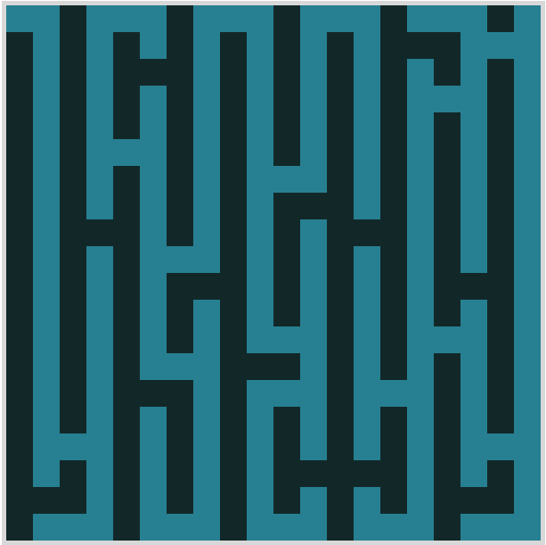

# Evolutionary Pixel Patterns

## Overview

Evolutionary Pixel Patterns is a personal coding project that employs a genetic algorithm as a heuristic search to generate optimal solutions for drawing patterns on a 2D grid of pixels. The algorithm mimics natural selection and genetics, creating a population of potential solutions represented as individuals with randomly generated patterns. Each individual's fitness is assessed based on how well its pattern adheres to given constraints. Through successive generations, individuals are selected, undergo crossover and mutation, and create offspring with potentially improved fitness. The algorithm iteratively refines the population, guiding the evolution towards patterns that increasingly satisfy the specified constraints, ultimately producing aesthetically pleasing and constraint-compliant visual compositions on the pixel grid.

### [Try it Out](http://evolutionarypixelpatterns.s3-website.us-east-2.amazonaws.com/index.html)

## Features

- **Genetic Algorithm:** Utilizes a genetic algorithm to evolve pixel patterns over multiple generations.
- **2D Grid:** Represents the canvas on which pixel patterns are generated and evolved.
- **Fitness Function:** Evaluates the quality of each pixel pattern based on predefined criteria.
- **Mutation and Crossover:** Implements mutation and crossover operators to introduce variation in pixel patterns and promote diversity in the population.

## Requirements

- Web browser with JavaScript enabled
- Text editor for editing HTML and JavaScript files

Since the project only uses vanilla JavaScript and HTML, there are no additional dependencies or requirements beyond a web browser and a text editor for code editing.

## Getting Started

1. Clone this repository to your local machine.
2. Open the repository folder in Visual Studio Code (VS Code).
3. Install the Live Server extension by searching for "Live Server" in the VS Code Extensions marketplace and clicking Install.
4. Right-click on the `index.html` file in VS Code, then select "Open with Live Server" to host the site locally.
5. The browser should automatically open with the hosted site. If not, you can access it at `http://127.0.0.1:5500/index.html`.
6. You can now interact with the application and generate pixel patterns.

This setup allows you to make changes to the code in VS Code and see the updates in real-time by refreshing the browser window.

## Usage

- Click on the "Generate Patterns" button to start the evolutionary algorithm.
- View the evolving pixel patterns on the 2D grid.
- Adjust the parameters in the HTML file to customize the behavior of the algorithm.

## Examples

Below are some examples of pixel patterns generated using this project:

## Contributing

Contributions are welcome! If you'd like to contribute to this project, feel free to fork the repository and submit a pull request. Adding new constraints, could lead to generating more interesting patterns!

p.s.

some ideas: tesalation constraint, symmetry constraint, force cyclic constraint...

## Acknowledgements

- My School notebook doodles for inspiring this project.

- An interesting paper that takes this idea further - [Generating art tile patterns using genetic algorithm](https://ieeexplore.ieee.org/document/7391652)
